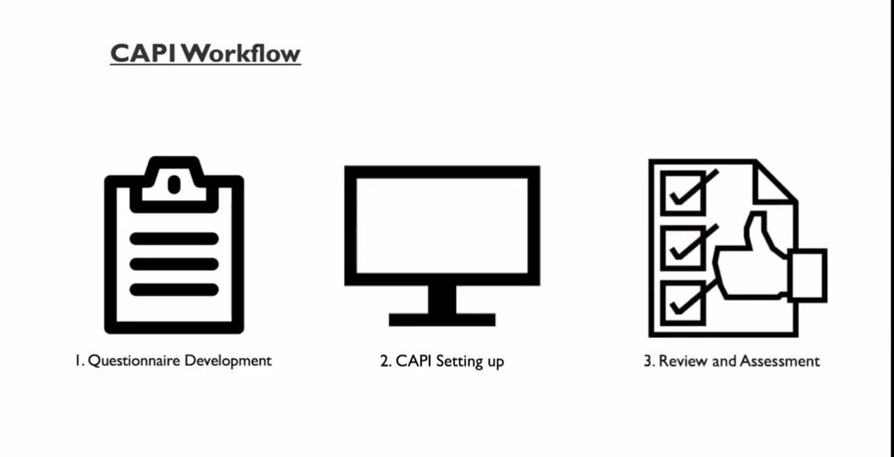
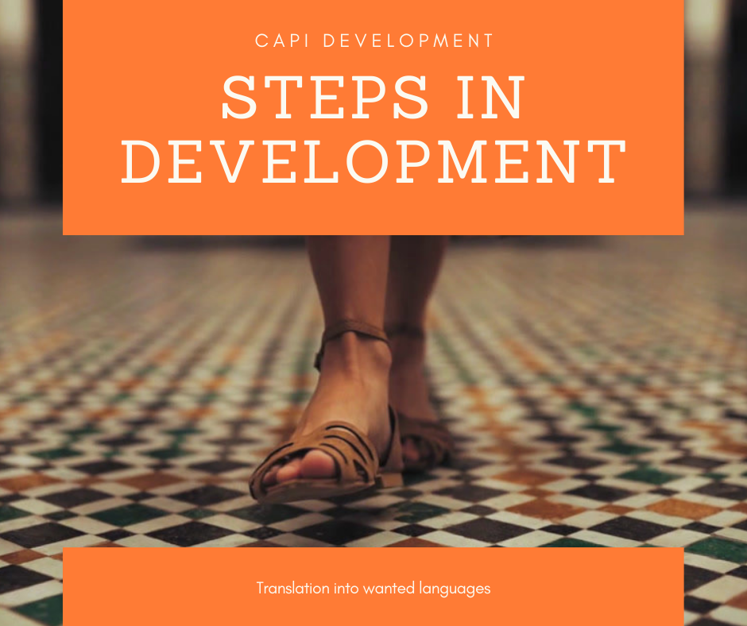

## Workflows for CAPIs: Computer-Assisted Personal Interviewing 

We are going to go through most of the modules for both CSPro and
Survey Solutions. I spent the last several years working on CAPI fieldwork projects across East Africa. In particular, focusing on the transition from paper-based collection to CAPI collection. In this post I would wish to share some of my experiences with you on how to make your transition as smooth as possible.

We're going to be focusing on CAPI workflow. The one thing I want you to take away from this post is that designing your system in CAPI is not a replacement for, first of all, having a version of your questionnaire made in Word or Excel. Think of it this way – you wouldn't build a house by picking up a hammer, a nail and some wood, and start building. 

First, you design a plan of how you want your house to look and then you'd go and build it to match that – the same should be said of a CAPI system. Also, having a version of the questionnaire that we can print out and physically hold on paper is really beneficial during interviewer training, and it can also serve as a final back up during field work. 

Let's take a look now at the CAPI workflow in more depth. For the CAPI workflow, there's three key steps to keep in mind:

* First of all, questionnaire developments; 

* Secondly, setting up your CAPI system; 

* and thirdly, review and assessments.

## Questionnaire developments

We should first design your questionnaire in a **master language**. For example this might be English, Kiswahili, French, Russian or Chinese, depending on your part of the world this version should be created in Word or Excel. This is going to serve as our paper version or master version.

It should be easily printable so you can create a paper version for training and backup purposes. Within this document, each questionnaire component:

* Question text,
* Answer options, 
* Interviewer instructions,
* Validation, and skip instructions 

All should be easily identifiable, meaning it's in a separate cell or a separate font. Next, it's time to set up the CAPI system. Once our paper version is complete and finalized, we should use as a guide to build our CAPI system – meaning all of the CAPI system questions, text, and functionalities should follow and match to what we've created in our paper version. 

## CAPI Development 

During the time of CAPI development, a simultaneous translation of the master version into any other required languages can take place. During translations, it's important to keep the components of the questionnaire in the same place, so that non speakers of that language can tell what part is what.

## Review and Assessment.

At this point we should test the CAPI system thoroughly and ensure it's working correctly and matching exactly to the master paper version of our questionnaire. Once the CAPI system is finalized and working well in the master language, it's time to insert other languages. Then we can test the system in your other languages with native speakers or the fieldwork teams if possible to make sure everything is where it should be. Next, today I want to talk about managing changes. It's inevitable during our projects the changes will be required to to the questionnaire – either after pre-test and pilot tests or during training. So when we have changes we should:

* First of all, make them in the master paper version. 

* Next, we'll update the CAPI system and the local language paper version and then finally, update the CAPI for the local language. During this process it's important to highlight the changes or additions in the paper versions. It's also important to strike-through deletions. This way, whoever's designed the system can see what's been taken away. It's difficult to see what isn't there. 

* Finally, use a new color or track changes for each round of changes if there's going to be multiple rounds. 