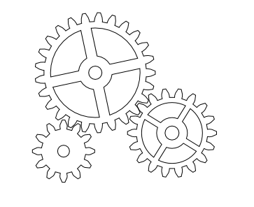
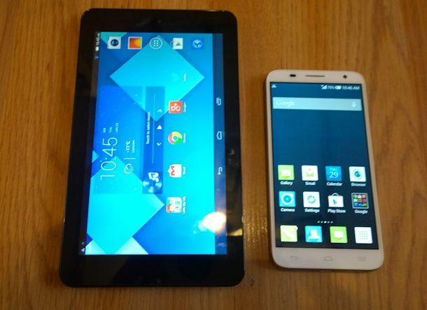

## An overview of Computer-Assisted Personal Interviewing

Surveys are very important in collection of data. In this post we talk about the difference of CAPI and PAPI. The believe is that CAPI is going to be the future of data collection all around the world.

We are going to have a really short introduction, introducing the concept of CAPI, talking about some of the work flows and also discussing some of the benefits of CAPI as opposed to the old method PAPI, pen and paper interviewing. So let's take a look, first of all at what exactly is CAPI. Computer-Assisted Personal Interviewing or CAPI as the name suggests, involves the use of computers during survey data collection. Nowadays we don't use physical computers themselves, we're using more devices like tablets and smartphones to conduct the data collection. This is because they're cheaper, smaller and portable to carry around the field. The broad benefits of CAPI are that it will enhance the statistical capability of any organization which is using it broadly speaking, because the data can collected faster, it's more accessible and it results in high quality data. 

## Implementation

We look now at the implementation between paper and pencil interviewing as opposed to computer-assisted personal interviewing. So the first few steps are the same -- we need to have a questionnaire and we need to have personnel enumerators and supervisors regardless of the method we're going to be doing. So the first three steps are really unaltered. The next part is where we see some big benefits in CAPI. If you've ever overseen a large paper-based survey, you'll see that the printing of questionnaires becomes:

 (1) Expensive
 
 (2) It chops down a lot of trees, and 
 
 (3) It's quite time-consuming to put all the questionnaires together and distribute them out to the interviewers.
 
So this step is really a lot faster in CAPI because after we've designed the data entry template, it's a very quick process to download this questionnaire onto the tablets and of course, no trees have to die in the making of a CAPI survey. Then fieldwork carries on much the same -- it's the same sort of process. The interviewers are doing the same job. The main difference is they're recording their answers directly into the tablet or smartphone as opposed to writing it down on the paper. On the paper side, we next have supervisors editing. This is where the supervisor would go back and check through the answers which the interviewer has given, make sure the skip patterns were followed correctly, no outrageous values and things like this. There's also a little bit of this in CAPI, we do need to do some QC work but a lot of this is taken away because the skip patterns are programmed automatically, so the interviewer can't follow a wrong skip pattern -- one of the big things supervisors used to check for, and also the data validation possible. So we have set ranges which the interviewers can enter for numeric values and things like this so there's much less mistakes. 

## Benefits of CAPI

CAPI's doing a lot of the supervisors'job which they used to do on the paper side. On the paper side, of course after the surveys are completed, we often had the process of somehow getting all the paper back from various parts of the country to the headquarters. So this could be quite of a process depending on the transport and logistical constraints where fieldwork is taking place. But CAPI makes this much easier for us in that we simply press upload, and through the magic of the internet the forms are sent directly back to headquarters instantly. So that's a huge benefit. 

The other benefit of CAPI here is that of course, there's no data entry. The data entry is taking place live during the survey. So no longer have that huge step. You probably remember a whole room full of piles and piles of paper questionnaires which need to be double keyed in and all these process -- these are all skipped in CAPI. So not only does it save a lot of hassle but it also means that the the process is happening faster. So we don't lose, you know, two weeks or a month after fieldwork before we can start to see the data. We can see the data immediately as it's taking place. Of course, we still have data cleaning and data analysis the same as we would in the paper days. The key benefits that CAPI offers us as we mentioned before, there's less or even no paper printouts so that's saving the trees and saving the cost. Our data accuracy is improved because we can set validations, so if an answer is illogical we can set certain rules within the CAPI system to prevent that from being entered. Next, the data availability is much faster. As soon as the interview is completed, it can be synchronized and sent back to the central server where it can be accessed by analysts right away. There's no more waiting for paper forms to come back to headquarters and be keyed in before we can see what's happening with the data. So that's a super good benefit in terms of speed, but also in terms of data quality, because we could be checking the quality of the data that comes back almost instantly rather than having to wait. So lower costs -- there's been some studies done that, of course, with CAPI we have a little bit of initial outlay to purchase all of these smartphones or tablets, but you know, the cost of those things are dropping by the day and these things have shown that after just a few surveys,that initial cost has been recouped, and you're actually starting to do cheaper fieldwork because there's no need for the costs of printing and there's no need for the cost of data entry staff. We have quicker access to the data of course as we said, we don't need to enter all in. 

We can download it instantly from the server, and that means data analysis can start faster. So the minute fieldwork finishes we can begin data cleaning and data analysis can take place soon after.

## Collection of Other Data Types Using CAPI

Another good thing about CAPI is there's, of course, some additional functionalities like GPS coordinates, multimedia collection, barcode scanning. There's a whole range of different inputs we can collect rather than what we could simply write down with a pen in the old days. Also CAPI can lead to increased sample sizes. So that brings us to the end of
this first lesson. 